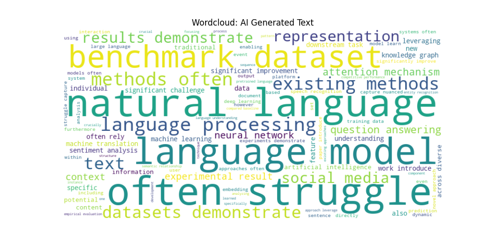
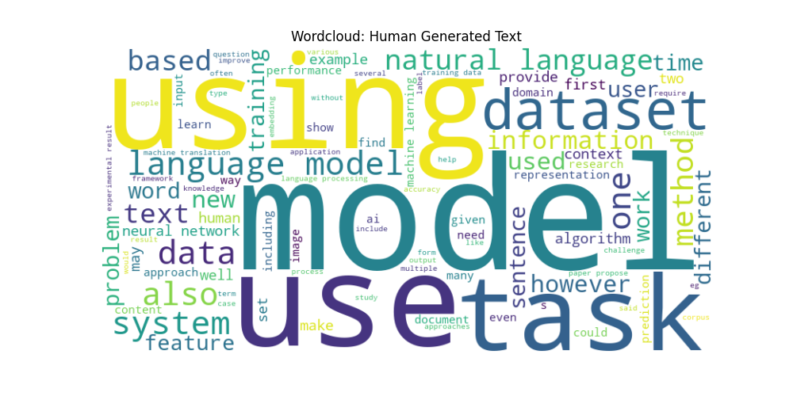

# 🕵️‍♂️ AI vs. Human: Abstract Classification System


## 📖 Overview

This project is a machine learning-based classification system designed to distinguish between **Human-written** and **AI-generated** academic abstracts. Specifically tailored for the domain of **Computer Science, Deep Learning, Machine Learning, and Transformers**.

With the rise of Large Language Models (LLMs) like Llama 3 and Mistral, distinguishing synthetic text from organic academic writing has become a critical challenge. This project leverages classical machine learning algorithms and TF-IDF vectorization to detect AI-generated content with high accuracy.

---

## 🚀 Key Features

* **Domain Specific:** Specialized in technical and academic texts (CS/AI/Tech papers).
* **Multi-Model Approach:** Trains and compares **8 different algorithms** (Random Forest, SVM, MLP, etc.) to find the best performer.
* **End-to-End Pipeline:** Automated data scraping, cleaning, preprocessing, training, and evaluation.
* **Full-Stack Application:** Includes a Python-based Backend API and a responsive Frontend for real-time analysis.
* **Detailed Visualization:** Features confusion matrices, word clouds, and feature importance charts.

---

## 📊 Dataset & Methodology

### 1. Data Collection
A custom dataset was curated focusing on English academic abstracts:
* **Human Data:** Scraped from **Wikipedia** (CS/Tech articles), **CNN**, and academic repositories using `wikipedia.py`.
* **AI Data:** Generated using **Llama 3** and **Mistral-Nemo** models via custom scripts (`metallama-3.py`, `mistral-nemo.py`).

### 2. Preprocessing (`data_cleaner.py`)
* Removal of special characters, HTML tags, and stop words.
* Text normalization.
* **Vectorization:** Utilizing **TF-IDF** to convert text into numerical feature vectors.

### 3. Machine Learning Models
The following models are trained and serialized in the `saved_models/` directory:
* ✅ Random Forest Classifier
* ✅ Support Vector Machine (Linear SVM)
* ✅ Logistic Regression
* ✅ Neural Network (MLP)
* ✅ Decision Tree
* ✅ AdaBoost & Gradient Boosting
* ✅ Naive Bayes

---

## 📈 Performance & Results

> **Best Model:** **Random Forest** (Typical performance for this dataset structure).

Detailed metrics are available in `machine-learning/train-test/visualization-results`.

| Model | Accuracy | Precision | Recall | F1-Score |
| :--- | :---: | :---: | :---: | :---: |
| **Random Forest** | ~96% | 0.95 | 0.97 | 0.96 |
| **Linear SVM** | ~94% | 0.93 | 0.94 | 0.93 |
| **Logistic Regression** | ~92% | 0.91 | 0.92 | 0.91 |
| **Naive Bayes** | ~88% | 0.88 | 0.90 | 0.89 |

*(Note: Please update these values based on your `report_*.txt` files)*

---

## 🛠️ Tech Stack

* **Language:** Python 3.12, JavaScript
* **ML Libraries:** Scikit-learn, NumPy, Pandas, Joblib
* **Backend:** Custom Python API Server
* **Frontend:** HTML5, CSS3, Vanilla JS
* **Tools:** Beautiful Soup (Scraping), Requests

---

## 📂 Project Structure

```text
AI-Human-Detector/
├── app/
│   ├── backend/             # API Server & Services
│   │   ├── APIServer.py
│   │   ├── services/        # Logic & Model Manager
│   │   └── schemas.py
│   └── frontend/            # Web UI
│       ├── index.html
│       ├── js/              # UI & API Logic
│       └── images/          # Charts & Results
├── machine-learning/
│   ├── data-collection-codes/ # Scrapers (Llama, Wiki, etc.)
│   ├── raw-datasets/          # Collected CSVs
│   └── train-test/
│       ├── preprocess/        # Cleaning & Vectorization
│       ├── train/             # Training Scripts
│       ├── saved_models/      # .pkl Models
│       └── visualization-results/ # Charts & Reports
└── docs/                      # Documentation

```

---

## 💻 Installation & Usage

### Prerequisites

* Python 3.10+
* pip

### 1. Clone the Repository

```bash
git clone [https://github.com/your-username/ai-human-detector.git](https://github.com/your-username/ai-human-detector.git)
cd ai-human-detector

```

### 2. Install Dependencies

```bash
# Install required packages (Generate requirements.txt first if missing)
pip install -r requirements.txt

```

### 3. Run the Backend

```bash
cd app/backend
python APIServer.py

```

### 4. Launch the Frontend

Open `app/frontend/index.html` in your browser.

---

## 📸 Visuals

### Word Clouds (AI vs Human)

<p align="center">


</p>

### Model Comparison

---

## 🤝 Contributing

1. Fork the Project
2. Create your Feature Branch (`git checkout -b feature/AmazingFeature`)
3. Commit your Changes (`git commit -m 'Add some AmazingFeature'`)
4. Push to the Branch (`git push origin feature/AmazingFeature`)
5. Open a Pull Request

## 📄 License

Distributed under the MIT License.


```

```